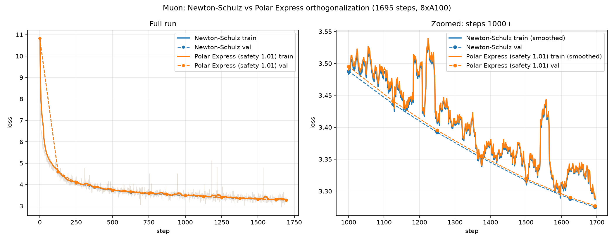

# Polar Express vs Newton-Schulz orthogonalization in Muon

Date: 2026-10-08. Hardware: 8x NVIDIA A100-SXM4-80GB. Config: stock speedrun
(`train_gpt.py`, 1695 steps, seq len 48K, lr=0.05, momentum warmup 0.85->0.95
over 300 steps), identical hyperparameters for both runs.

## What was tested

Muon replaces the momentum-averaged gradient of each 2D hidden weight matrix
with its nearest semi-orthogonal matrix. The baseline computes this with the
classic 5-step quintic Newton-Schulz iteration (coefficients
`(3.4445, -4.7750, 2.0315)`). This record swaps in the **Polar Express**
iteration (coefficient schedule from the Polar Express paper, 5 steps), keeping
everything else — Triton `ns_line_*` kernels, bf16 compute, distributed update
sharding — unchanged.

The saved `train_gpt.py` contains both variants, selected by an env var:

```bash
ORTHO=ns    bash run.sh train_gpt.py   # Newton-Schulz baseline
ORTHO=polar bash run.sh train_gpt.py   # Polar Express (default)
```

## Results

| orthogonalizer | final train loss | final val loss | wall time |
|---|---|---|---|
| Newton-Schulz | 3.3780 | **3.2750** | 422s |
| Polar Express (safety 1.01) | 3.3819 | **3.2770** | 423s |



## Findings

1. **Raw Polar Express diverges at these hyperparameters.** Without a safety
   factor the run collapsed: a loss spike at step ~161, brief recovery, then
   permanent collapse at step 211 with loss pinned at 10.8258 = ln(50257)
   (uniform output). See `compare_polar.log`. The aggressive first coefficient
   triple `(8.287, -23.596, 17.300)` overshoots for singular values that are
   not yet close to 1, which the fixed lr=0.05 cannot absorb during momentum
   warmup.

2. **A 1.01 safety factor fixes it.** Scaling each pre-fixpoint coefficient
   triple by `(a/1.01, b/1.01^3, c/1.01^5)` (last triple left at the fixed
   point) makes training fully stable — no spikes, loss monotone to the end.

3. **At equal hyperparameters it lands marginally behind NS.** Polar Express
   trails by up to +0.013 val loss mid-run (step ~250); the gap narrows
   monotonically to +0.0020 by the final eval (last five gaps: +0.0031,
   +0.0031, +0.0024, +0.0022, +0.0020). Small but consistent, not noise.

4. **Zero runtime cost.** Both variants reuse the same Triton kernels, so step
   time is identical (~250ms/step, ~422s total).

## Files

- `train_gpt.py` — script used for both runs (ORTHO switch, Polar Express with
  safety factor)
- `run.sh` — launcher (torchrun, 8 GPUs, DISABLE_FP8=1)
- `compare_ns.log` / `run_ns.txt` — Newton-Schulz run (console log / code+env dump)
- `compare_polar.log` / `run_polar_diverged.txt` — Polar Express without safety
  factor (diverged at step 211, killed at step ~1056)
- `compare_polar_sf.log` / `run_polar_sf.txt` — Polar Express with safety factor
- `compare_polar_vs_ns.png` — comparison plot (full run + zoomed tail)
- `plot_compare.py` — script that parses the logs and renders the plot

## Possible follow-ups

- Nudge the Muon lr slightly for Polar Express (its weaker spectral push
  effectively shrinks the update) to check whether the +0.002 gap closes.
- Try 6+ Polar Express steps, or safety factor closer to 1.0 (e.g. 1.005), if
  bf16 rounding turns out to be the real instability source.
