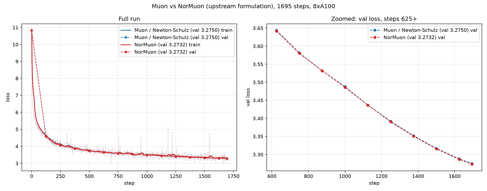
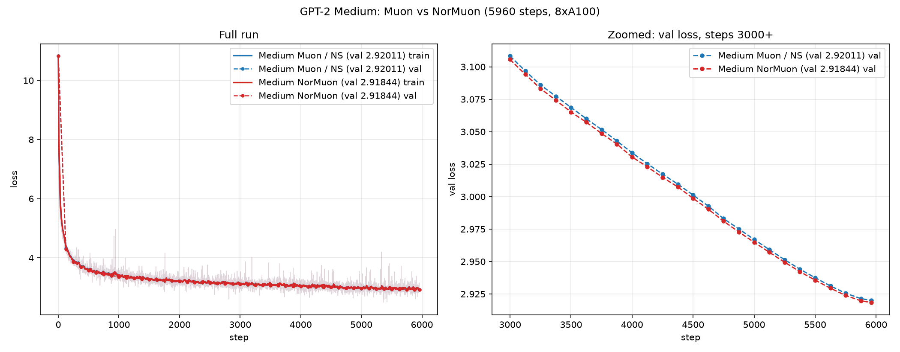

# NorMuon: neuron-wise normalized Muon

Date: 2026-10-09. Hardware: 8x NVIDIA A100-SXM4-80GB.

Testing [NorMuon](https://arxiv.org/abs/2510.05491) (neuron-wise normalized
Muon) against the Muon baseline at two scales, using the formulation from the
upstream speedrun record `records/track_1_short/2025-10-24_NorMuon`.

## Implementation

After the usual Muon momentum + Newton-Schulz orthogonalization, each hidden
matrix update gets:

1. a per-neuron second-moment EMA over the orthogonalized update
   (`v2 ← β2·v2 + (1−β2)·mean(O², axis)`, β2=0.95, fp32, statistics along the
   **short side** of each matrix),
2. division by `sqrt(v2)`, equalizing per-neuron update magnitudes,
3. **Frobenius-norm restoration** — the update is rescaled to its
   pre-normalization norm, so the total step size is exactly Muon's and the
   standard Muon learning rate (`lr·max(1,r/c)^0.5`) applies unchanged.

Norm restoration is the key difference from the paper's Algorithm 1, which
uses `η̂ = 0.2·η·√(mn)/‖Ô‖` instead. See "What didn't work" below.

Files: `train_gpt_normuon.py` (124M speedrun, block in `NorMuon.step`),
`train_gpt_medium_normuon.py` (GPT-2 Medium, block inside the compiled
`update()` with the bf16+mantissa accumulator).

## Results

| model | steps | Muon val loss | NorMuon val loss | Δ |
|---|---|---|---|---|
| speedrun 124M | 1695 | 3.2750 | **3.2732** | −0.0018 |
| GPT-2 Medium | 5960 | 2.92011 | **2.91844** | −0.0017 |

Identical hyperparameters, step time (±0.5ms), and memory (one extra
short-side vector per matrix) in both comparisons.

### Findings

- **NorMuon wins at both scales**, by nearly the same absolute margin
  (~0.0017–0.0018 val loss).
- **The gain is largest early**: −0.017 (124M) / −0.030 (medium) at step 125,
  when momentum buffers are young and per-neuron update norms are most uneven.
  It then settles to a persistent ~0.002–0.003 mid-run and ~0.0017 at the end.
- **Medium-scale diff is negative at all 47 evals** — systematic, not seed
  noise. On 124M, NorMuon leads at every eval of the last 5 (and 12 of 14
  after step 0).
- The large early advantage suggests the benefit would grow in shorter or
  more token-limited runs.

## What didn't work (paper-literal implementation)

The first attempt followed Algorithm 1 literally and failed twice:

1. `eff_lr = lr·0.2·(mn)^(−0.5)/‖Ô‖` (exponent sign flipped vs the paper's
   `√mn`) made updates ~10⁵× too small — caught numerically before running.
2. With the exponent fixed, the paper's η̂ targets per-element update
   RMS = 0.2·lr = 0.01 at this repo's `lr=0.05` — ~6× the baseline Muon's
   actual update RMS (1.7e-3), because the speedrun's LR units differ from
   the paper's setup. The loss went NaN at step 2 (see
   `run_normuon_small_nan.txt`).

The upstream record's norm-restoration formulation avoids this entirely by
construction: NorMuon changes only the *distribution* of the update across
neurons, never its total magnitude.

Also note: the second-moment EMA must be `v2 ← β2·v2 + (1−β2)·x`
(`lerp_(x, 1 − β2)`), mirroring the first momentum; and NS returns bf16, so
cast to fp32 before computing statistics.

## Files

- `train_gpt_normuon.py` / `train_gpt_medium_normuon.py` — NorMuon scripts
  (run with `bash run.sh <script>` from the repo root)
- `compare_normuon.log` / `run_normuon_small.txt` — 124M NorMuon run
- `compare_medium_normuon.log` / `run_normuon_medium.txt` — medium NorMuon run
- `run_normuon_small_nan.txt` — failed paper-literal run (NaN at step 2)
- `baseline_small_muon.log` — 124M Muon baseline (same run as in
  `../2026-10-08_PolarExpress/compare_ns.log`)
- `baseline_medium_muon.log` — medium Muon baseline (same run as in
  `../2026-10-03_FlexBF16Medium/run_train_gpt_medium_20261003_133652.log`)
- `compare_normuon_vs_ns.png`, `compare_medium_normuon_vs_muon.png` — plots
