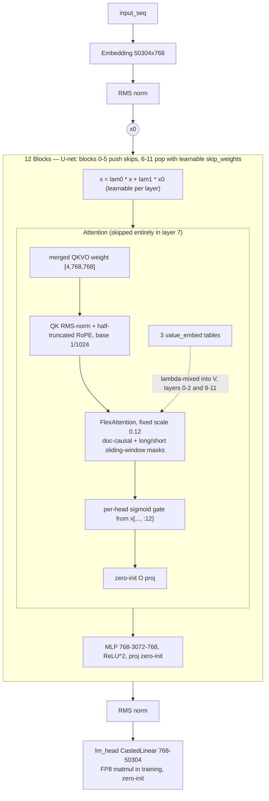

# train_gpt.py Model Architecture

Date: 2026-10-03
Source: `GPT` class at `train_gpt.py:659`, instantiated at `train_gpt.py:885`
(vocab 50257 padded to 50304, 12 layers, 6 heads, model_dim 768, head_dim 128).

## Why this is needed
The speedrun model diverges from vanilla GPT-2 in many small ways (U-net skips,
value embeddings, sliding-window FlexAttention, attention gate), so a single
diagram is a faster reference than re-reading the model code.

## Architecture

## Differences from standard GPT-2
| Aspect | GPT-2 small | This model |
|---|---|---|
| Norm | LayerNorm with bias | RMS norm, no biases anywhere (`train_gpt.py:532`) |
| Positions | learned absolute embeddings | half-truncated RoPE, base 1/1024 (`train_gpt.py:557`) |
| Heads | 12 heads x 64 dims | 6 heads x 128 dims |
| Attention | scale 1/sqrt(head_dim) | fixed scale 0.12, plus QK RMS-norm |
| Masking | dense causal | doc-causal + long/short sliding window (`train_gpt.py:739`) |
| Attention extras | none | per-head sigmoid gate; layer 7 has no attention |
| Values | V from hidden state only | 3 value-embed tables lambda-mixed into V, layers 0-2 and 9-11 |
| MLP | GELU | ReLU^2; both weights stored as [768, 3072] |
| Residual stream | plain pre-norm | U-net skips + learnable mix with x0 every layer |
| Weights | separate QKV/O with biases | single merged QKVO parameter per block |
| Init | N(0, 0.02), scaled proj init | uniform 0.5/sqrt(dim); lm_head, O, MLP proj zero-init |
| LM head | tied to token embedding | untied, FP8 matmul in training, vocab padded to 50304 |
| Optimizer | Adam(W) for everything | Muon for matrices, Adam for embeds/head/scalars |

## Key details
- Skip weights, block lambdas, and value-mix lambdas are learnable scalars (`train_gpt.py:676`).
- Per-parameter lr multipliers: embed/value_embeds x75, scalars x5 (`train_gpt.py:683-688`).
