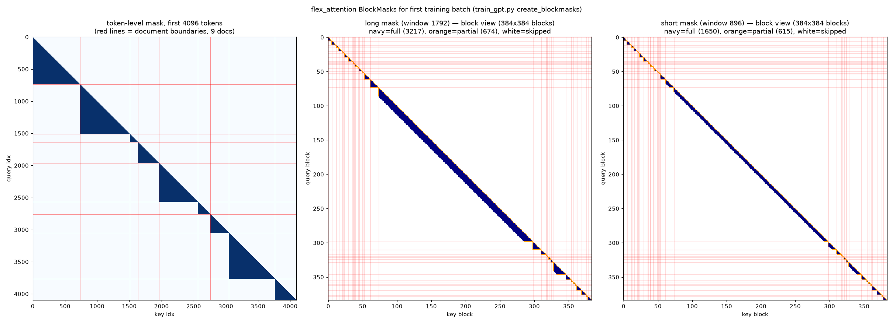

# FlexAttention mask logic in train_gpt.py

Date: 2026-10-04
Hardware/Environment: A100, torch 2.10.0+cu128, matplotlib 3.11.2 (only needed for the visualization script)

## Why this is needed

`train_gpt.py` uses `torch.nn.attention.flex_attention` instead of plain SDPA / FlashAttention
varlen because the mask combines three constraints that no fused kernel exposes together:

1. **Causal** — query only attends to keys at or before its position.
2. **Document (varlen)** — documents are packed into one batch-1 sequence; attention never
   crosses `<|endoftext|>` (token 50256) boundaries. Same effect as `flash_attn_varlen_func`'s
   `cu_seqlens`, but expressed as a mask.
3. **Sliding window (SWA)** — Gemma-2-style long/short alternation across layers, and the window
   itself grows over training (128 -> 1792 tokens, block-quantized). This is a cost/quality
   tradeoff: attention is quadratic in lookback distance, and ablations showed most of the value
   is local; only 4 of 12 layers get the long window.

The mask is built manually each step in `GPT.create_blockmasks` (train_gpt.py:690) because
flex_attention's automatic mask tracing is slow and the window size changes every step.

## How the mask construction works

### Logical rule

`docs = (input_seq == 50256).cumsum(0)` assigns each token a document ID. The per-token ground
truth is `document_causal` (train_gpt.py:694): `q_idx >= kv_idx AND docs[q] == docs[kv]`, passed
to the kernel as `mask_mod`.

### Block-level decomposition (train_gpt.py:704-717)

The kernel tiles attention into 128x128 blocks and classifies each (query_block, key_block) pair:

- **full** — every pair in the tile is allowed; kernel runs with no masking (fast path).
- **partial** — some pairs allowed; kernel applies `mask_mod` elementwise.
- neither — **skipped entirely**, zero FLOPs. This is most of the matrix (~97% of blocks for the
  first batch at max window) and is what makes 48K-token sequences affordable.

Classification is done with small 384x384 boolean grids (`BLOCK_SIZE=128`, 48K seq -> 384 blocks):

- Causal: `_any` = key block index <= query block index; `_all` = strictly less (diagonal block
  is only partially causal).
- Document: each block spans doc IDs `[docs_low, docs_high]` (first/last token). `_any` = interval
  overlap test; `_all` = both blocks contain exactly one, identical document.
- `blockmask_any = causal_any & doc_any`, `blockmask_all = causal_all & doc_all`;
  partial = `any & ~all`.

`dense_to_ordered` (train_gpt.py:699) packs each boolean row into the CSR-like layout
`BlockMask.from_kv_blocks` expects: per query block a count (`kv_num_blocks`) plus key-block
indices sorted **most-recent-first** (stable ascending argsort, then flip). Recency-first ordering
is what makes the sliding window a simple prefix truncation.

### Sliding window + long/short masks (train_gpt.py:718-728)

`build_bm` truncates each row's index list arithmetically via clamping: keep at most
`W - full_count` partial blocks (at least 1, so a query always sees its own block) and at most
`W - 1` full blocks. It returns two masks: long (window W) and short (W // 2), assigned per layer
at train_gpt.py:739 — layers 0, 4, 7, 11 are long, the rest short. Note layer 7's long mask is
unused because that layer has no attention at all (see next section), so only layers 0, 4, 11
actually perform long-window attention.

The window comes from `get_window_size_blocks` (train_gpt.py:922): `next_multiple_of_n(1728*x, 128)`
where `x = step/num_iterations`, so it ramps 128 -> 1792 tokens (rounded up to block multiples) and
stays block-quantized so `torch.compile(dynamic=False)` never recompiles.

### Why it doesn't hurt loss much

First-batch stats: 49,152 tokens, 37 documents -> average doc ~1,300 tokens, shorter than the final
1,792-token window. The window only binds on the minority of long documents; elsewhere the document
boundary truncates first, so the mask behaves like plain causal varlen attention.

## Related: layer 7 has no attention

`Block.__init__` skips the attention module entirely for layer 7 (`if layer_idx != 7`,
train_gpt.py:643). Origin: speedrun record #17 (2024-12-17, "Sparsify value embeddings, improve
rotary embeddings, drop an attn layer", by @YouJiacheng; log + stats in
records/121724_SparsifyEmbeds/, validated over 1,261 runs at mean val 3.2794). Per the author's
changelog (https://x.com/YouJiacheng/status/1868938024731787640):

| change | steps | time |
|---|---|---|
| Truncate RoPE | 1460 | 224.5s |
| ValueEmbed `[0..5,5..0]` -> `[0,1,2,None,...,None,0,1,2]` | 1470 | 222s |
| Remove the 8th attention | 1490 | 214.9s |

Removing the layer slightly hurt per-step quality (1470 -> 1490 steps needed) but made each step
enough cheaper that total wall-clock dropped ~7s — a net win under the speedrun metric. The
records don't say why index 7 specifically; consistent with the U-net structure (layers 0-5
encode, 6-11 decode with skip connections from their encoder counterparts), layer 7 sits just
past the bottleneck and receives a fresh skip from layer 4, making its attention the most
redundant — same rationale as stripping value embeddings from all six middle layers
(`012...012`) in the same record.

## Visualization

`visualize_mask.py` (repo root) replicates the mask logic standalone on CPU (train_gpt.py cannot be
imported — it starts distributed training at import). It loads the real first BOS-aligned training
batch from `data/fineweb10B/fineweb_train_000001.bin` and plots the token-level mask plus the
long/short block-level masks.

```bash
python visualize_mask.py   # writes img/attn_mask_first_batch.png; copy it next to this note
```



Observed output:

- Left panel: per-document causal staircase; red lines are document boundaries.
- Middle/right: 384x384 block view, navy = full (computed unmasked), orange = partial
  (mask_mod applied), white = skipped. Long mask: 3,217 full + 674 partial blocks; short mask
  (window 896): 1,650 full + 615 partial. The band widens around blocks ~290-340 where documents
  are long enough that the window, not the doc boundary, is the binding constraint.
- Note: final-step window is 1792, not 1728, because `next_multiple_of_n` rounds up to a block
  multiple.

## Caveats

- The script's full/partial block assignment is a reimplementation of `build_bm`'s clamp logic, so
  per-block counts may differ marginally from the real `BlockMask` internals; structure is faithful.
- For ground truth, call `BlockMask.to_dense()` on a GPU run.
- Early training steps use window = 128 (single block); the figure shows the final step's window.
